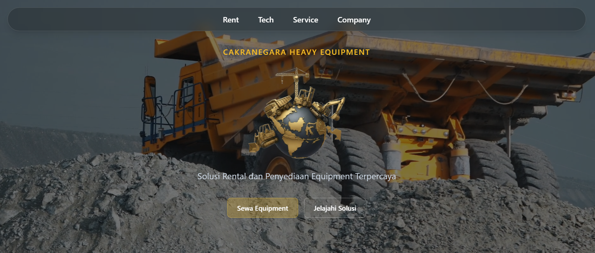

# 🏗️ Cakranegara – Heavy Equipment Rental 🚜

[](https://opensource.org/licenses/MIT)

## 📌 Overview

**Cakranegara** is a web-based heavy equipment rental platform based in Indonesia. The system is designed to streamline rental operations, improve efficiency, and provide a seamless experience for customers through digital transformation.

This platform is also integrated with an AI-powered customer service chatbot using **Gemini AI**, enabling automated responses and real-time assistance. *(Note: The chatbot feature is currently undeployed.)*

---

## 🎯 Key Features

* 🚧 **Heavy Equipment Rental Management**
  Manage and explore various heavy equipment available for rent.

* 📦 **Booking & Rental System**
  Simplifies the process of renting equipment for customers.

* 🤖 **AI Customer Service Chatbot**
  Integrated with Gemini AI for automated customer support *(undeployed)*.

* 🔐 **Authentication & User Management**
  Secure login system and user data management.

* 🎨 **Modern UI/UX**
  Clean and responsive interface for better user experience.

---

## 🛠️ Tech Stack

* **Framework:** Astro (JavaScript Framework)
* **Frontend:** HTML, TypeScript, CSS, Tailwind CSS
* **AI Integration:** Gemini AI (Customer Service Chatbot – undeployed)

---

## 🚧 Project Status

⚠️ This project is currently under development.
Some features, including the **Gemini AI chatbot**, are not yet deployed.

---

## 📍 Purpose

The goal of this project is to modernize heavy equipment rental services in Indonesia by:

* Increasing accessibility for customers
* Automating customer service with AI
* Improving operational efficiency

---

## 📸 Screenshots



---

## 🚀 Getting Started

### Installation

```bash
git clone https://github.com/your-username/cakranegara.git
cd cakranegara
npm install
```

### Run the Project

```bash
npm run dev
```

---

## 🤝 Contributing

Contributions are welcome! Feel free to fork this repository and submit a pull request.

---

## 📄 License

This project is licensed under the MIT License.
